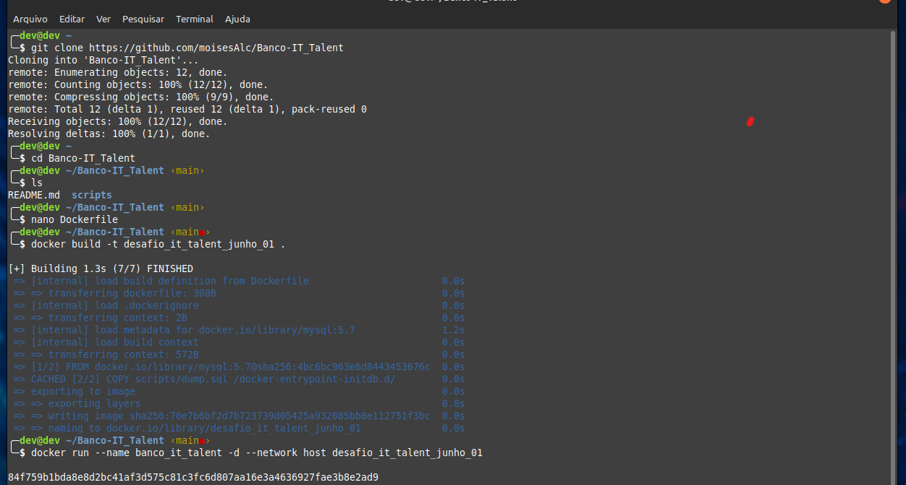
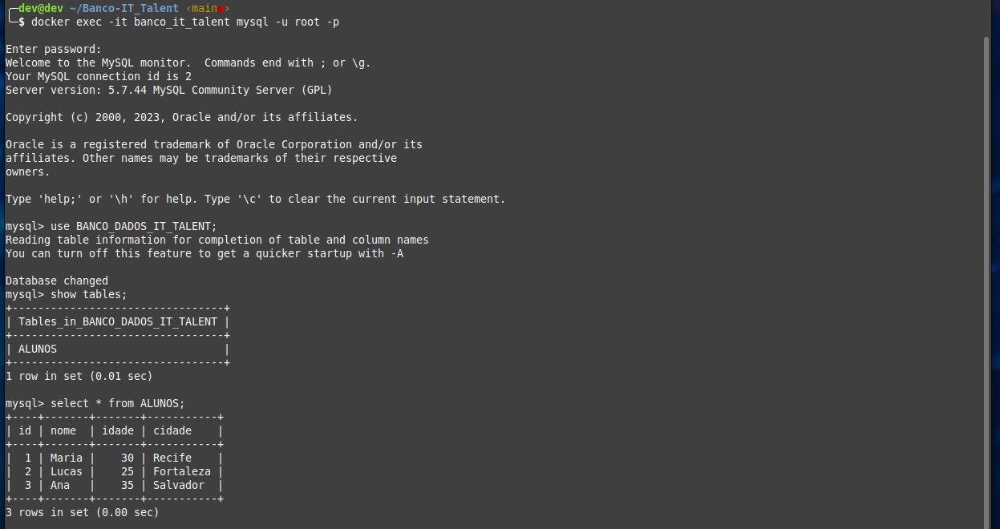

# Banco-IT_Talent

### Passo inicial: clone o repositório, adicione o arquivo Dockerfile com as informações necessárias, posteriormente faça o build e execute.

### Verificação do Banco de Dados: Conecte-se ao container do banco de dados e confirme se ele está populado.

